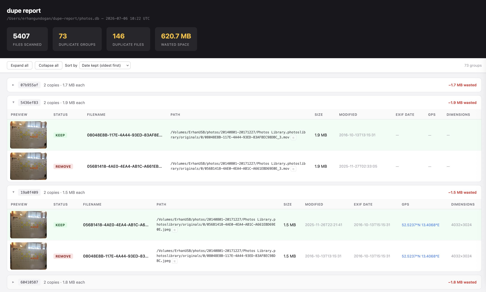

# dupe

A fast CLI tool for finding duplicate images across large file collections.

Scans directories recursively, hashes every image with BLAKE3, and writes duplicate file paths to stdout: one per line, ready to pipe into `trash` or `rm`. Results are also saved as JSONL or SQLite for downstream analysis.

## Features

- **Exact duplicates**: BLAKE3 hash, byte-for-byte identical files
- **Visual duplicates**: dHash perceptual hashing via `--similar` flag (finds re-saves, resized copies)
- **EXIF metadata**: automatically extracted for JPEG/HEIC/TIFF/DNG (shoot date, GPS coordinates, dimensions)
- **Parallel processing**: rayon saturates all CPU cores; handles tens of thousands of files
- **Pipe-friendly output**: REMOVE candidates printed to stdout one per line; progress on stderr
- **JSONL output**: one JSON object per file, append-mode, ready for `jq` or database ingestion
- **SQLite output**: `--output-sqlite` writes all 12 fields to a local SQLite database; re-scanning upserts by path
- **HTML report**: `dupe-report` reads the SQLite database and generates a self-contained HTML review page
- **Semantic search**: `dupe-embed` computes SigLIP embeddings; `dupe-search` finds images by text or example image

## Supported File Types

`.jpg` `.jpeg` `.png` `.gif` `.webp` `.bmp` `.tiff` `.mov` `.heic` `.mp4` `.dng`

## Installation

```bash
git clone git@github.com:erhangundogan/dupe.git
cd dupe
cargo build --release
```

Binaries are at `./target/release/dupe`, `./target/release/dupe-report`, `./target/release/dupe-fix-dates`, `./target/release/dupe-embed`, and `./target/release/dupe-search`.

## Usage

```bash
dupe [OPTIONS] <directory>
```

### Options

| Flag | Description | Default |
|------|-------------|---------|
| `--output <path>` | JSONL output file (appended on each run) | `/tmp/hashes` |
| `--output-sqlite <path>` | SQLite output file (upserts by path on each run) | |
| `--similar` | Also find visually similar images via perceptual hash | off |
| `--silent` | Suppress progress output on stderr (stdout paths are always written) | off |

`--output` and `--output-sqlite` are mutually exclusive: passing both exits with an error.

### Examples

```bash
# Preview which files would be removed
dupe ~/Photos

# Delete duplicates
dupe ~/Photos | xargs trash

# Silent: no stderr noise, just the paths
dupe --silent ~/Photos | xargs trash

# Write results to SQLite, then open an HTML review report
dupe --output-sqlite ~/photos.db ~/Photos
dupe-report ~/photos.db

# Also find visually similar images (review report before deleting)
dupe --similar --output-sqlite ~/photos.db ~/Photos
dupe-report ~/photos.db -o ~/Desktop/report.html
```

## Output

### stdout: duplicate paths (pipe-ready)

REMOVE candidates are written to stdout, one absolute path per line. The KEEP candidate (oldest by `exif_date`, falling back to `min(created_at, modified_at)`; `0000-*` EXIF dates are treated as absent) is not printed.

```
/Photos/backup/IMG_001.jpg
/Photos/copy2/photo.jpg
/Photos/2023/IMG_001_copy.jpg
```

Pipe directly into any deletion tool:

```bash
dupe ~/Photos | xargs trash
dupe ~/Photos | xargs -I{} mv {} ~/Duplicates/
dupe --silent ~/Photos > to_delete.txt
```

### stderr: progress summary

```
Scanning "/Users/erhan/Photos"...
Found 12483 file(s) to process
Wrote 12483 record(s) to "/tmp/hashes"
3 duplicate group(s), 7 file(s) to remove.
```

Suppressed with `--silent`.

### JSONL file

One JSON object per line, appended on every run. EXIF fields (`exif_date`, `gps_lat`, `gps_lon`, `width`, `height`) are present for JPEG/TIFF/HEIC/DNG files that contain EXIF data, and absent for all others.

```json
{"path":"/Photos/2019/vacation/IMG_001.jpg","hash":"a3f2c1d8...","size_bytes":3145728,"created_at":"2019-08-12T14:22:00+00:00","modified_at":"2019-08-12T14:22:00+00:00","ext":"jpg","exif_date":"2019-08-12T14:22:00","gps_lat":41.015,"gps_lon":28.979,"width":4032,"height":3024}
```

#### Fields

| Field | Type | Description |
|-------|------|-------------|
| `path` | string | Absolute file path |
| `hash` | string | BLAKE3 hex hash (exact duplicate key) |
| `size_bytes` | number | File size in bytes |
| `created_at` | string \| null | ISO 8601 creation time (null on Linux) |
| `modified_at` | string \| null | ISO 8601 modification time |
| `ext` | string | Lowercase file extension |
| `phash` | number | dHash value (only present with `--similar`) |
| `exif_date` | string \| null | Camera-local shoot date from EXIF `DateTimeOriginal`, no timezone (jpg/jpeg/tiff/heic/dng only); `0000-*` values from cameras with unset clocks are discarded (stored as null) |
| `gps_lat` | number \| null | GPS latitude in decimal degrees, negative = South (jpg/jpeg/tiff/heic/dng only) |
| `gps_lon` | number \| null | GPS longitude in decimal degrees, negative = West (jpg/jpeg/tiff/heic/dng only) |
| `width` | number \| null | Image width in pixels from EXIF (jpg/jpeg/tiff/heic/dng only) |
| `height` | number \| null | Image height in pixels from EXIF (jpg/jpeg/tiff/heic/dng only) |

### SQLite database

When using `--output-sqlite`, a `file_hashes` table is created (if it doesn't exist) with all 12 columns. Re-scanning the same folder with the same database file upserts existing records by `path`: no duplicates accumulate.

```sql
CREATE TABLE file_hashes (
    path        TEXT PRIMARY KEY,
    hash        TEXT NOT NULL,
    size_bytes  INTEGER,
    created_at  TEXT,
    modified_at TEXT,
    ext         TEXT,
    phash       INTEGER,
    exif_date   TEXT,
    gps_lat     REAL,
    gps_lon     REAL,
    width       INTEGER,
    height      INTEGER
);
```

### HTML report (`dupe-report`)



Reads the SQLite database and generates a self-contained HTML file for visual review before deletion.

```bash
dupe-report ~/photos.db                         # writes photos_report.html next to the db
dupe-report ~/photos.db -o report.html          # explicit output path
dupe-report ~/photos.db --heic                  # embed HEIC thumbnails (macOS only, requires sips)
dupe-report ~/photos.db --heic-original         # embed HEIC thumbnails + 1200px lightbox version
```

The report shows:
- Stats summary (files scanned, duplicate groups, duplicate files, wasted space)
- Toolbar with Expand all / Collapse all and a sort dropdown: wasted space (default), date kept oldest-first, date kept newest-first
- Duplicate groups with KEEP/REMOVE badges, image thumbnails, created date, EXIF date, GPS map links, copy-path buttons
- `.mov` and `.mp4` files displayed as video thumbnails; click to play in a lightbox overlay
- `.heic` files require `--heic` for thumbnails (embedded as base64 JPEG via `sips`; macOS only)

## Semantic search (`dupe-embed` / `dupe-search`)

After scanning, embed images with SigLIP (google/siglip-so400m-patch14-384) and search by text or example image.

```bash
# Embed all images (downloads model weights from Hugging Face on first run; resumable)
dupe-embed ~/photos.db

# Search by text query
dupe-search ~/photos.db "sunset on beach"

# Search by example image
dupe-search ~/photos.db --image query.jpg

# Top-k results with cosine scores
dupe-search ~/photos.db "birthday cake" -k 10 --scores
```

Embeddings are stored as 1152-dim L2-normalized f16 BLOBs keyed by content hash. Re-running `dupe-embed` only processes missing hashes. `.mov`, `.mp4`, and `.dng` files are skipped (the image decoder has no DNG support; EXIF metadata is still available from the scan). HEIC files are converted via `sips` (macOS only).

```sql
CREATE TABLE embeddings (
    hash        TEXT PRIMARY KEY,
    model_id    TEXT NOT NULL,
    embedding   BLOB NOT NULL,
    embedded_at TEXT NOT NULL
);
```

## Fixing file dates (`dupe-fix-dates`)

After deduplication, run `dupe-fix-dates` to align each file's `modified_at` timestamp with its EXIF shoot date. This makes Finder, sort-by-date views, and backup tools see the correct original capture time instead of a corrupted copy timestamp.

```bash
dupe-fix-dates ~/photos.db --dry-run   # preview which files would be updated
dupe-fix-dates ~/photos.db             # apply: set mtime = exif_date
dupe-fix-dates ~/photos.db --silent    # apply without per-file output
```

Only files with `exif_date` in the database are touched. `exif_date` is treated as local system time. Only `modified_at` is updated: macOS birth time (`created_at`) is not changed. Files that no longer exist on disk (e.g. duplicates already trashed) are silently skipped and shown in the summary as "no longer on disk (skipped)" rather than counted as errors.

### Recommended workflow

```bash
# 1. Scan
dupe --output-sqlite ~/photos.db ~/Photos

# 2. Review
dupe-report ~/photos.db

# 3. Delete duplicates
dupe --output-sqlite ~/photos.db ~/Photos | xargs trash

# 4. Fix timestamps on remaining files
dupe-fix-dates ~/photos.db

# 5. Embed for semantic search (optional)
dupe-embed ~/photos.db

# 6. Search by description or example
dupe-search ~/photos.db "golden gate bridge"
dupe-search ~/photos.db --image reference.jpg
```

## Pipeline Usage

### Query with jq (JSONL)

```bash
# Show the redundant copies (all but the oldest in each group)
jq -s 'group_by(.hash) | map(select(length > 1)) | map(sort_by(.modified_at)[1:]) | flatten | .[] | .path' ~/hashes.jsonl

# Total wasted space in MB
jq -s 'group_by(.hash) | map(select(length > 1)) | map(.[0].size_bytes * (length - 1)) | add / 1048576' ~/hashes.jsonl

# Filter by file type
jq 'select(.ext == "heic")' ~/hashes.jsonl
```

### Query with SQLite

```bash
sqlite3 ~/photos.db

SELECT hash, COUNT(*) AS n FROM file_hashes GROUP BY hash HAVING n > 1;

SELECT hash, path, exif_date, modified_at
FROM file_hashes
WHERE hash IN (SELECT hash FROM file_hashes GROUP BY hash HAVING COUNT(*) > 1)
ORDER BY hash, COALESCE(exif_date, modified_at);

SELECT SUM(size_bytes * (cnt - 1)) AS wasted_bytes
FROM (SELECT hash, size_bytes, COUNT(*) AS cnt FROM file_hashes GROUP BY hash HAVING cnt > 1);
```

### Load into PostgreSQL

```sql
CREATE TABLE file_hashes (
    path        TEXT PRIMARY KEY,
    hash        TEXT NOT NULL,
    size_bytes  BIGINT,
    created_at  TIMESTAMPTZ,
    modified_at TIMESTAMPTZ,
    ext         TEXT,
    phash       BIGINT,
    exif_date   TIMESTAMP,
    gps_lat     DOUBLE PRECISION,
    gps_lon     DOUBLE PRECISION,
    width       INTEGER,
    height      INTEGER
);
```

```bash
cat /tmp/hashes | \
  jq -r '[.path, .hash, .size_bytes, .created_at, .modified_at, .ext, .phash, .exif_date, .gps_lat, .gps_lon, .width, .height] | @tsv' | \
  psql -c "COPY file_hashes FROM STDIN"
```

## How It Works

### Exact duplicates (default)

Files are hashed with [BLAKE3](https://github.com/BLAKE3-team/BLAKE3) using a 64 KB streaming buffer. Files with identical hashes are exact byte-for-byte copies regardless of filename or location. The KEEP candidate within each group is the file with the oldest `exif_date` (camera-captured time); if absent, the older of `created_at` and `modified_at` is used.

### Visual duplicates (`--similar`)

Uses [dHash](http://www.hackerfactor.com/blog/index.php?/archives/529-Kind-of-Like-That.html) (difference hash):

1. Resize image to 9×8 pixels (grayscale)
2. For each row, compare 8 adjacent pixel pairs → 1 bit per pair
3. Result: 64-bit fingerprint

Two images are considered similar when their Hamming distance is ≤ 10 (out of 64 bits). This finds resized copies, re-compressed JPEGs, and minor edits. `.mov` and `.heic` files are excluded from perceptual hashing (exact hash still runs). Similar groups are reported on stderr only: review with `dupe-report` before deleting.

## Project Structure

```
crates/
  dupe/
    Cargo.toml
    src/{main.rs,scanner.rs,hasher.rs,output.rs,sqlite_output.rs,types.rs,bin/}
    tests/integration.rs
  dupe-core/
    Cargo.toml
    src/lib.rs
    src/vectors.rs
    src/embeddings.rs
  dupe-ml/
    Cargo.toml
    src/lib.rs
    src/{device.rs,model.rs,preprocess.rs,search.rs}
    src/bin/{dupe-embed.rs,dupe-search.rs}
```

## License

MIT
